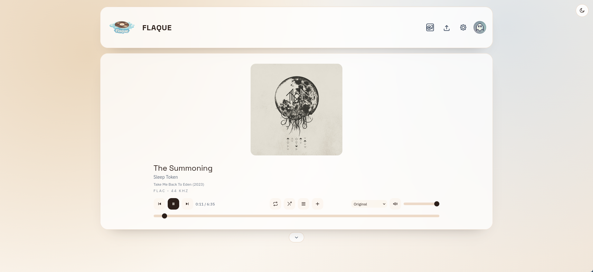

# Flaque

<p align="center">
  
</p>

<p align="center"><strong>F</strong>ile-based <strong>L</strong>ibrary <strong>A</strong>udio <strong>QU</strong>ery <strong>E</strong>ngine</p>

Flaque is a self-hosted web audio player focused on local-first music libraries, hi-fi playback, and practical operations.
The core principle is simple: your files stay the source of truth, and the app builds a modern listening experience around them.

## Description and Definitions

| Term | Definition |
| --- | --- |
| **Self-hosted** | The app runs on your own machine, NAS, VM, or server. You keep control of data and operations. |
| **File-based library** | Audio tracks are stored as regular files in the filesystem, not in an opaque media blob. |
| **Library index** | A generated JSON index used to speed up filtering, browsing, and playback discovery. |
| **FLAC-first** | Original quality is preferred whenever possible, with optional fallback transcoding when needed. |
| **DATA_ROOT** | Runtime data root used for config DB, uploads, cache, and generated indexes. |

## Screenshot

Current Player view with active playback:



## Key Challenges

- **Data ownership**: keep full control over music files and metadata.
- **Audio quality + UX**: combine hi-fi streaming with a clean, responsive interface.
- **Operational simplicity**: keep runtime structure explicit, inspectable, and easy to backup.
- **Multi-user access**: provide admin/user roles and durable sessions without heavyweight infrastructure.
- **Long-term maintainability**: keep a codebase that can evolve safely with product and UX needs.

## How to Build

### Prerequisites

- Node.js 20+
- npm 10+
- `ffmpeg` / `ffprobe` available in `PATH`

Debian/Ubuntu:

```bash
sudo apt-get update
sudo apt-get install -y ffmpeg
```

### Installation

```bash
npm install
cp backend/.env.example backend/.env
```

Set at least the following values in `backend/.env`:

- `ADMIN_USERNAME`
- `ADMIN_EMAIL`
- `ADMIN_PASSWORD`

To enable password recovery emails, also configure SMTP:

- `SMTP_HOST`, `SMTP_PORT`, `SMTP_SECURE`
- `SMTP_USER`, `SMTP_PASS`
- `SMTP_FROM`

### Run in development

```bash
npm run dev
```

- Frontend: `http://localhost:5173`
- Backend: `http://localhost:4000`

### Build and test

```bash
npm run test
npm run test:e2e
npm run build
```

### Production build/deployment (Docker)

```bash
npm run prod:setup
```

Then use the manual lifecycle commands:

```bash
npm run prod:up
npm run prod:down
```

Operational helpers:

```bash
# Reset (or create) an admin password
npm run prod:admin:reset-password -- <username>

# Delete and recreate auth DB (users + sessions), then bootstrap admin from .env.production
npm run prod:authdb:reset
```

## Technical Choices

- **npm workspaces monorepo** (`backend`, `frontend`) to keep product/API/UI changes aligned.
- **Backend: Node.js + Express + TypeScript** for clear HTTP services with strong typing.
- **SQLite (`better-sqlite3`)** for auth/session persistence with zero external infra.
- **Frontend: React + Vite + Tailwind** for fast UX iteration and lightweight builds.
- **Audio metadata extraction via `music-metadata` + `ffprobe`** for tags, codec info, and covers.
- **Filesystem runtime storage** (`data/`) for portability, inspectability, and straightforward backups.

Default runtime layout:

```text
data/
  config/
    users.db
  storage/
    users/
      <userId>/
        uploads/
  cache/
    covers/
    transcodes/
    tmp-uploads/
  index/
    library-index.json
```

## How to Contribute

1. **Create a branch** from `master` (`feature/...`, `fix/...`, `ux-...`).
2. **Work in small increments** with focused, readable commits.
3. **Validate locally** before opening a PR:

```bash
npm run test
npm run build
```

4. **Open a Pull Request** including:
   - problem/context
   - proposed solution
   - UX/technical impact
   - screenshots for UI changes
5. **Do not commit `data/` runtime artifacts** unless explicitly required and justified.

## API Documentation

Detailed API reference is available as an OpenAPI specification at:

- [docs/openapi.yaml](docs/openapi.yaml)

You can preview it in tools such as Swagger Editor by importing the file, or run Swagger UI locally:

```bash
npm run docs:api
```

Then open `http://localhost:8080`.
