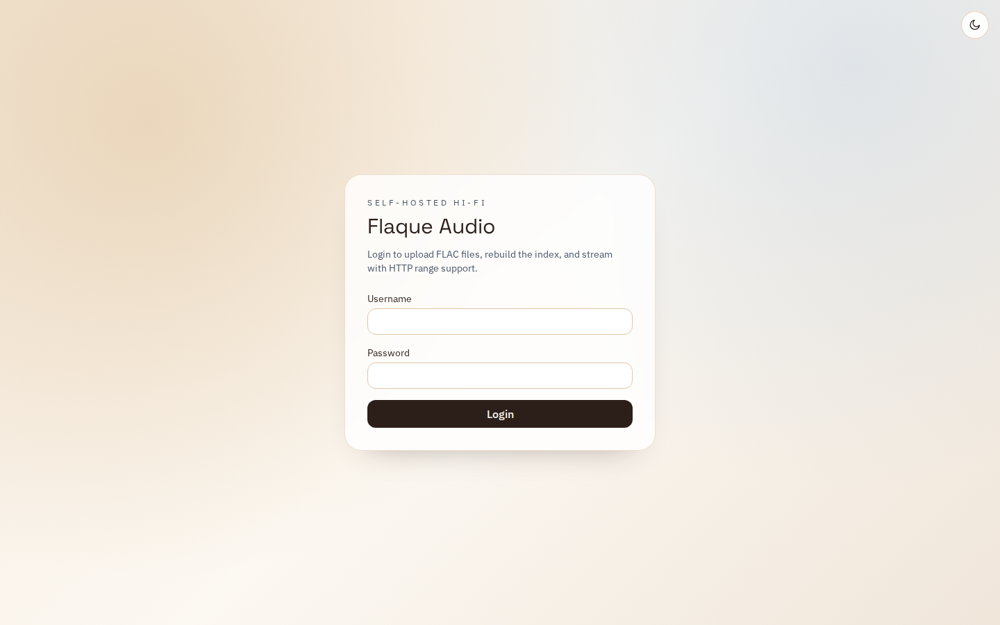

# Flaque

<p align="center">
  
</p>

<p align="center"><strong>F</strong>ile-based <strong>L</strong>ibrary <strong>A</strong>udio <strong>QU</strong>ery <strong>E</strong>ngine</p>

Flaque est un lecteur audio web auto-heberge, centre sur la musique locale et la qualite d'ecoute.
Le projet assume un principe simple: vos fichiers restent la source de verite, l'application construit l'experience autour.

## Description / definitions

| Terme | Definition |
| --- | --- |
| **Self-hosted** | L'application tourne chez vous (machine locale, NAS, VM ou serveur) et vous gardez le controle de vos donnees. |
| **File-based library** | Les pistes audio sont stockees dans le systeme de fichiers, pas dans un blob opaque. |
| **Index de bibliotheque** | Un index JSON derive des fichiers audio pour accelerer recherche, filtres et navigation. |
| **FLAC-first** | Le flux original est privilegie; des fallbacks de transcodage peuvent etre proposes selon le contexte. |
| **DATA_ROOT** | Racine des donnees runtime (utilisateurs, uploads, cache, index), separee du code source. |

## Screenshot

Capture de l'interface actuelle (ecran de connexion) :



## Enjeux

- **Souverainete des donnees**: conserver la maitrise des fichiers audio et des metadonnees.
- **Qualite audio + UX moderne**: concilier streaming hi-fi, navigation rapide et player utilisable au quotidien.
- **Operabilite simple**: structure de donnees lisible, reproductible et inspectable.
- **Multi-utilisateur sans complexite**: auth/sessions robustes avec roles admin/user.
- **Evolution durable**: base technique claire pour iterer sur UX et gouvernance du projet.

## Comment builder

### Prerequis

- Node.js 20+
- npm 10+
- `ffmpeg` / `ffprobe` dans le `PATH`

Debian/Ubuntu:

```bash
sudo apt-get update
sudo apt-get install -y ffmpeg
```

### Installation

```bash
npm install
cp backend/.env.example backend/.env
```

Configurer au minimum dans `backend/.env`:

- `ADMIN_USERNAME`
- `ADMIN_PASSWORD`

### Lancer en developpement

```bash
npm run dev
```

- Frontend: `http://localhost:5173`
- Backend: `http://localhost:4000`

### Builder et tester

```bash
npm run test
npm run build
```

### Build/deploiement production (Docker)

```bash
npm run prod:setup
```

Puis cycle manuel:

```bash
npm run prod:up
npm run prod:down
```

## Choix techniques

- **Monorepo npm workspaces** (`backend`, `frontend`) pour garder une evolution coherente produit/API/UI.
- **Backend Node.js + Express + TypeScript** pour un service HTTP simple, type et facile a maintenir.
- **SQLite (`better-sqlite3`)** pour les users/sessions: zero infra externe, fiable pour un usage self-hosted.
- **Frontend React + Vite + Tailwind** pour iterer vite sur l'UX tout en gardant un bundle maitrise.
- **Parsing audio avec `music-metadata` + `ffprobe`** pour extraire tags, qualite audio et covers.
- **Stockage runtime sur filesystem** (`data/`) pour garder une topologie explicite et portable.

Structure runtime (par defaut):

```text
data/
  config/
    users.db
  storage/
    users/
      <userId>/
        uploads/
  cache/
    covers/
    transcodes/
    tmp-uploads/
  index/
    library-index.json
```

## Comment contribuer

1. **Creer une branche** depuis `master` (`feature/...`, `fix/...`, `ux-...`).
2. **Developper en petites increments** avec des commits lisibles et focalises.
3. **Verifier localement** avant PR:

```bash
npm run test
npm run build
```

4. **Ouvrir une Pull Request** avec:
   - contexte/probleme
   - solution proposee
   - impact UX/technique
   - captures d'ecran si UI
5. **Eviter de versionner `data/`** (runtime), sauf besoin explicite et justifie.

## Documentation API

La reference API detaillee sera sortie du README et publiee via une specification OpenAPI dans un second temps.
